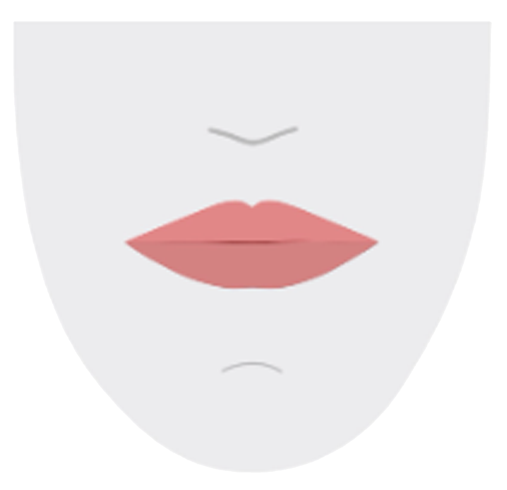

# 🗣️ Animação de Visemes com Azure TTS

## 🧱 Estrutura Geral

O código está dividido em 3 partes principais:

1. **Entrada do usuário e botão** – onde você digita o texto.  
2. **Função `speak()`** – responsável por chamar o Azure TTS e coletar os visemes.  
3. **Função `startVisemeAnimation()`** – sincroniza as imagens com o áudio.

---

## 🔍 Explicação Detalhada

### 🔹 1. HTML – Parte visual

```html
<input type="text" id="text" placeholder="Digite o texto" size="50">
<button onclick="speak()">Falar</button>

```

- O usuário digita um texto.
- Ao clicar em **"Falar"**, a função `speak()` é chamada.
- A imagem com `id="mouth"` será trocada dinamicamente para animar os visemes.

---

### 🔹 2. `speak()` – Sintetiza texto + coleta visemes

#### Configuração da fala:

```js
const speechConfig = SpeechSDK.SpeechConfig.fromSubscription(subscriptionKey, serviceRegion);
speechConfig.speechSynthesisVoiceName = "pt-BR-AntonioNeural";
speechConfig.setProperty(SpeechSDK.PropertyId.SpeechServiceResponse_RequestViseme, "true");
```

- Configura o SDK com sua **Azure Key** e **Região**.
- Ativa a opção para receber os visemes.

#### Player de áudio:

```js
const player = new SpeechSDK.SpeakerAudioDestination();
const audioConfig = SpeechSDK.AudioConfig.fromSpeakerOutput(player);
```

- Cria um player que permite detectar o início e fim do áudio.
- Essencial para sincronizar a boca com o som.

#### Recebendo visemes:

```js
synthesizer.visemeReceived = function (s, e) {
  const visemeId = e.visemeId;
  const offset = e.audioOffset / 10000000.0;
  visemes.push({ viseme: visemeId, time: offset });
};
```

- Salva cada viseme com seu tempo correspondente (convertido de “ticks” para segundos).

#### Início do áudio:

```js
player.onAudioStart = () => {
  audioStartTime = performance.now() / 1000;
  startVisemeAnimation();
};
```

- Marca o tempo de início do áudio e chama a animação dos visemes.

---

### 🔹 3. `startVisemeAnimation()` – Faz o lipsync acontecer

#### Loop de animação:

```js
animationInterval = setInterval(() => {
  const now = performance.now() / 1000;
  const elapsed = now - audioStartTime;

  if (currentIndex < visemes.length && elapsed >= visemes[currentIndex].time) {
    const visemeId = visemes[currentIndex].viseme;
    mouth.src = `viseme_${visemeId}.png`;
    currentIndex++;
  }

  if (currentIndex >= visemes.length) {
    clearInterval(animationInterval);
  }
}, 30);
```

- A cada 30ms, verifica quanto tempo passou desde o início do áudio.
- Atualiza a imagem da boca conforme o tempo de cada viseme.
- Encerra a animação quando todos os visemes forem exibidos.

---

### 🔹 4. Imagens

Você precisa ter os 22 arquivos de imagem chamados:

```
viseme_0.png
viseme_1.png
...
viseme_21.png
```

- Cada imagem representa a forma da boca para um som ou grupo de sons.
- O Azure envia os IDs dos visemes conforme o áudio.

---

## ✅ Em resumo:

| Componente         | Função                                      |
|--------------------|----------------------------------------------|
| `SpeechSDK`        | Biblioteca da Azure para TTS                 |
| `visemeReceived`   | Captura eventos de movimento de boca        |
| `onAudioStart`     | Marca quando o áudio começa                 |
| `setInterval`      | Atualiza a imagem da boca em tempo real     |
| `viseme_X.png`     | Arquivos que representam os movimentos da boca |
